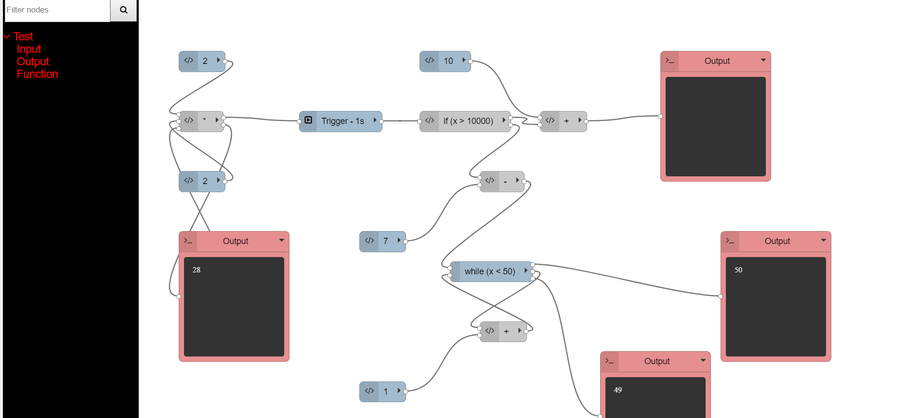

# FEUP_ASSO

In this repository there is the practical assignment of this course in the lective year of 2017/2018.

This course had the objective of teaching students a more in-depth knowldege on software architectural issues such as design patterns and its applicabilities, with special focus on GOF-patterns, architectural styles, etc.

The following points were the main objectives of the course:

*  Recognize the main architectural styles.
*  Describe software architecture in a detailed and precise way.
*  Idealize different architectural alternatives to solve the same problem and evaluate which is the best, being in design or reuse terms.
*  Recognize and comprehend diverse design patterns.
*  Know and apply different methods and techniques of software reusability.
*  Build a software system of medium dimension according to a specification of requisits and an architectural specification, selecting and applying different design patterns, using a development method based on components and recent technologies.

The project mainly consisted on creating a tool capable of executing code (such as algebric and string operations) based on dragging, dropping and connecting blocks. The blocks however had the objective of being indepent from eachother, making the architecture that constructed them, very reusable. To do this, and also being the main difficulty of the project, each block communicated with other blocks connected to them via mqtt using many different design patterns such as factory method, template method, etc.



Fig1 - Final project.

In order to successfully compile this project, you will need the following pre-requisites:

* `node` and `npm`, check this [Getting started guide](https://docs.npmjs.com/getting-started/installing-node);
* `grunt`, check [Installing Grunt](https://gruntjs.com/installing-grunt);
* `sass` preprocessor, check [Installing SASS](http://sass-lang.com/install).
* `docker` check [Install Docker](https://docs.docker.com/install/).
* `docker-compose` check [Install Docker Compose](https://docs.docker.com/compose/install/)

After that, you can simply:

```
$> npm install
$> grunt
$> docker-compose up
$> npm start
```

Which will:
1. Install all required libraries;
2. Run the default grunt tasks;
3. Run the default backend, and;
4. Automatically open your browser at `public/main.html` for the client-side application.


Credits:
* [Mário Fernandes](https://github.com/MarioFernandes73)
* [Inês Gomes](https://github.com/inesgomes)
* [João Loureiro](https://github.com/JLoureir0)
* [Tiago Filipe](https://github.com/backpt)
